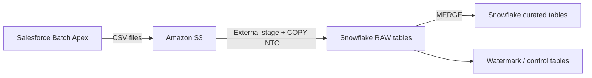

Proposal: Salesforce to Snowflake via S3 and Snowflake Tasks
============================================================

Objective
---------
Build a simple, reliable daily pipeline to extract Salesforce data (Account,
Opportunity, Case) and load it into Snowflake using only Salesforce Batch
Apex, Amazon S3, and Snowflake Tasks. No Lambda or third-party ETL tools.

Scope
-----
- Objects: Account, Opportunity, Case
- Volume: 5,000 to 10,000 rows per day
- Latency: Daily batch

Proposed Architecture
---------------------
- Salesforce Batch Apex queries data and writes CSV to S3
- Amazon S3 for raw file storage
- Snowflake external stage + COPY INTO for loading
- Snowflake MERGE for curated tables
- Snowflake Tasks for scheduling the load

Flow Diagram (Text-Based)
-------------------------


Data Flow (Daily Batch)
-----------------------
1) Salesforce Batch Apex runs daily and queries Accounts, Opportunities, Cases.
2) Batch builds CSV per chunk and uploads to S3 using a Named Credential.
3) A manifest (e.g., _SUCCESS) is written once all chunks upload.
4) Snowflake Task runs after the export window.
5) Task uses COPY INTO to load raw staging tables from S3.
6) Task MERGEs into curated tables.
7) Update the watermark only if all steps succeed.

Incremental Strategy
--------------------
Use SystemModstamp for incremental extraction:
WHERE SystemModstamp > :last_success_ts
  AND SystemModstamp <= :job_start_ts

Deletes can be handled by including IsDeleted and using ALL ROWS
or via the Get Deleted endpoint if needed.

Salesforce Batch Apex Notes
---------------------------
- Use Named Credential with AWS SigV4 for S3 access.
- Use run-specific prefixes and write a _SUCCESS marker.
- Keep CSV per batch chunk to stay within Apex limits.

S3 Layout (Example)
-------------------
s3://bucket/sf/account/2026-01-30/run_001/Account_1.csv
s3://bucket/sf/opportunity/2026-01-30/run_001/Opportunity_1.csv
s3://bucket/sf/case/2026-01-30/run_001/Case_1.csv
s3://bucket/sf/account/2026-01-30/run_001/_SUCCESS

Snowflake DDL and Task SQL (Example)
------------------------------------
Storage integration, file format, and stage:
```sql
CREATE OR REPLACE STORAGE INTEGRATION SF_S3_INT
  TYPE = EXTERNAL_STAGE
  STORAGE_PROVIDER = 'S3'
  ENABLED = TRUE
  STORAGE_AWS_ROLE_ARN = 'arn:aws:iam::<account-id>:role/snowflake-s3-role'
  STORAGE_ALLOWED_LOCATIONS = ('s3://bucket/sf/');

CREATE OR REPLACE FILE FORMAT SF_CSV_FORMAT
  TYPE = CSV
  FIELD_OPTIONALLY_ENCLOSED_BY = '"'
  SKIP_HEADER = 1
  NULL_IF = ('', 'NULL')
  TRIM_SPACE = TRUE
  EMPTY_FIELD_AS_NULL = TRUE;

CREATE OR REPLACE STAGE SF_S3_STAGE
  URL = 's3://bucket/sf/'
  STORAGE_INTEGRATION = SF_S3_INT
  FILE_FORMAT = SF_CSV_FORMAT;
```

Raw and curated tables (Account example):
```sql
CREATE OR REPLACE TABLE RAW_ACCOUNT (
  ID STRING,
  NAME STRING,
  TYPE STRING,
  INDUSTRY STRING,
  CREATEDDATE STRING,
  LASTMODIFIEDDATE STRING,
  SYSTEMMODSTAMP STRING,
  ISDELETED STRING
);

CREATE OR REPLACE TABLE ACCOUNT (
  ID STRING,
  NAME STRING,
  TYPE STRING,
  INDUSTRY STRING,
  CREATEDDATE TIMESTAMP_NTZ,
  LASTMODIFIEDDATE TIMESTAMP_NTZ,
  SYSTEMMODSTAMP TIMESTAMP_NTZ,
  ISDELETED BOOLEAN
);
```

Daily Task (Account example):
```sql
CREATE OR REPLACE TASK SF_ACCOUNT_LOAD_TASK
  WAREHOUSE = ETL_WH
  SCHEDULE = 'USING CRON 0 2 * * * UTC'
AS
BEGIN
  COPY INTO RAW_ACCOUNT
    FROM @SF_S3_STAGE/account/
    FILE_FORMAT = (FORMAT_NAME = SF_CSV_FORMAT)
    PATTERN = '.*\\.csv'
    ON_ERROR = 'CONTINUE';

  MERGE INTO ACCOUNT tgt
  USING (
    SELECT
      ID,
      NAME,
      TYPE,
      INDUSTRY,
      TO_TIMESTAMP_NTZ(CREATEDDATE) AS CREATEDDATE,
      TO_TIMESTAMP_NTZ(LASTMODIFIEDDATE) AS LASTMODIFIEDDATE,
      TO_TIMESTAMP_NTZ(SYSTEMMODSTAMP) AS SYSTEMMODSTAMP,
      IFF(UPPER(ISDELETED) = 'TRUE', TRUE, FALSE) AS ISDELETED
    FROM RAW_ACCOUNT
  ) src
  ON tgt.ID = src.ID
  WHEN MATCHED THEN UPDATE SET
    NAME = src.NAME,
    TYPE = src.TYPE,
    INDUSTRY = src.INDUSTRY,
    CREATEDDATE = src.CREATEDDATE,
    LASTMODIFIEDDATE = src.LASTMODIFIEDDATE,
    SYSTEMMODSTAMP = src.SYSTEMMODSTAMP,
    ISDELETED = src.ISDELETED
  WHEN NOT MATCHED THEN INSERT (
    ID, NAME, TYPE, INDUSTRY, CREATEDDATE, LASTMODIFIEDDATE,
    SYSTEMMODSTAMP, ISDELETED
  ) VALUES (
    src.ID, src.NAME, src.TYPE, src.INDUSTRY, src.CREATEDDATE,
    src.LASTMODIFIEDDATE, src.SYSTEMMODSTAMP, src.ISDELETED
  );
END;
```
Notes:
- COPY INTO skips already-loaded files by default.
- Use a manifest marker (e.g., _SUCCESS) to avoid partial loads.

Error Handling and Observability
--------------------------------
- If any object load fails, do not advance watermark.
- Write run stats to a Snowflake ETL_RUNS table.
- Use Salesforce job logs and Snowflake load history for troubleshooting.

Security
--------
- Salesforce uses Named Credentials for AWS SigV4.
- Snowflake uses a storage integration role scoped to the S3 prefix.
- Encrypt S3 data at rest (SSE-S3 or SSE-KMS).

Deliverables
------------
- Batch Apex code (Account, Opportunity, Case to S3)
- Snowflake DDL for storage integration, stage, tables, and tasks
- S3 bucket structure and stage setup
- Runbook and troubleshooting notes

Assumptions
-----------
- Daily loads complete within Batch Apex limits.
- Salesforce fields for the three objects are stable; new fields
  are handled by updating the raw and curated schemas.
